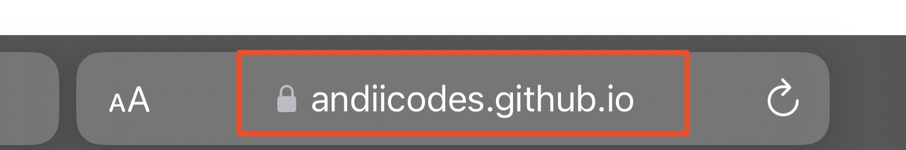
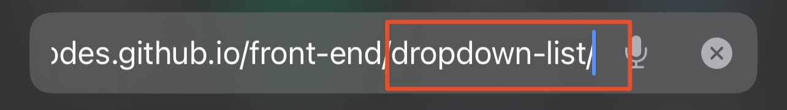
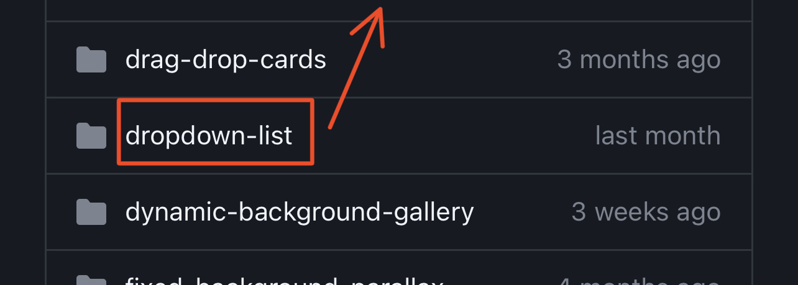

# Front-end🚀 Don't forget to 

You can find the source code for all the Instagram posts here!

If you want to see previews of these files, follow these steps:

## Step 1
Go to <a href="https://andiicodes.github.io/front-end">andiicodes.github.io/front-end</a>
 

  

## Step 2
Add any folder name that you like after the word "/front-end"
 

  

## Step 3
For example:
Go to <a href="https://andiicodes.github.io/front-end/dropdown-list">andiicodes.github.io/front-end/dropdown-list</a>
 

  

|| check it out on my instagram! @andiicodes , or click this icon > 

Telegram : <a href="https://t.me/andiicodes" traget="_blank">@AndiiCodes</a>
